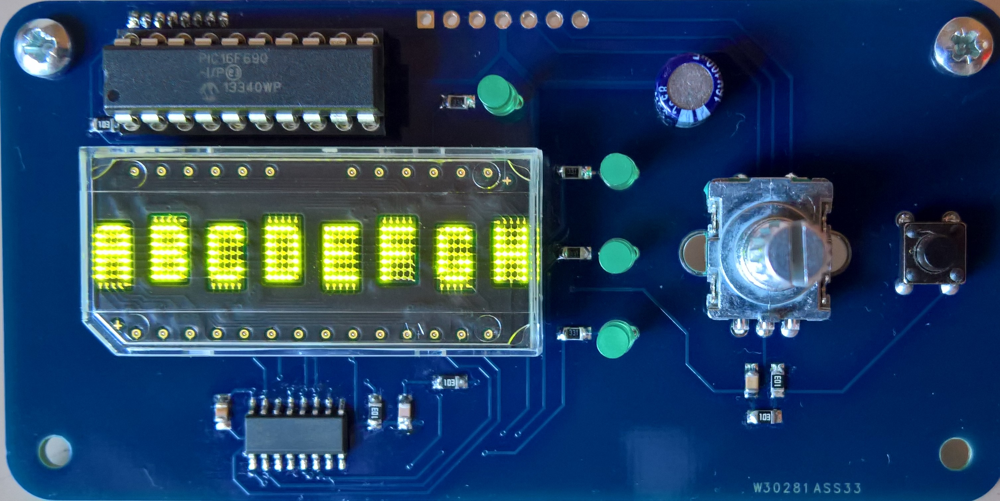
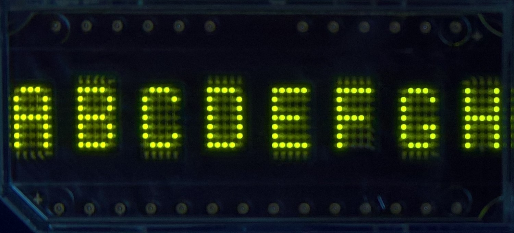

# HDSP-21xx-driver

    
    

A driver for LED character displays. The PCB is designed as generic frontpanel for several projects.

### Compatible Models

- HDSP-2107
- HDSP-2112
- HDSP-2110
- HDSP-2111
- HDSP-2113
- HDSP-2504 \*
- HDSP-2502 \*
- HDSP-2500 \*
- HDSP-2501 \*
- HDSP-2503 \*

\* Due to their dimensions they are only software compatible and do not fit on the PCB.

---

# Serial Protocol
## Frame
| command | length | data | checksum |
|:---:|:---:|:---:|:---:|
| 1 byte |  1 byte | `length` bytes |  1 byte |

### Answer Status
The answers first data byte is a status byte, which is interpreted as following:
| Byte | Value | Description |
|:---|:---|:---|
| DATA0 | 0x00 0x01 0x02 0x03 0x04 ... 0xFF | OK General error Invalid checksum Invalid parameter _res._ |

## Commands
### Get Info
#### Command
| Byte | Value | Description |
|:---|:---|:---|
| CMD | 0x01 ||
| LEN | 0x01 ||
| DATA | 0x00 0x01 ... 0xFF | Version _res._ |
| CS | 0xXX ||

#### Answer Version
| Byte | Value | Description |
|:---|:---|:---|
| CMD | 0x01 ||
| LEN | 0x04 ||
| DATA0 1 2 3 | 0xXX 0x00 0xXX 0xXX | Status Info: Version Version major Version minor |
| CS | 0xXX ||

### Set Display
#### Command
| Byte | Value | Description |
|:---|:---|:---|
| CMD | 0x0A ||
| LEN | 0x08 ||
| DATA0 ... DATA7 | 0xXX ... 0xXX | Digit 0 ... Digit 7 |
| CS | 0xXX ||

#### Answer
| Byte | Value | Description |
|:---|:---|:---|
| CMD | 0x0A ||
| LEN | 0x01 ||
| DATA | 0xXX | Status |
| CS | 0xXX ||

### Set I/O
#### Command
| Byte | Value | Description |
|:---|:---|:---|
| CMD | 0x10 ||
| LEN | 0x01 ||
| DATA | 0x0X | **_bit 0_** LED 1 ... **_bit 3_** LED 4 |
| CS | 0xXX ||

#### Answer
| Byte | Value | Description |
|:---|:---|:---|
| CMD | 0x10 ||
| LEN | 0x01 ||
| DATA | 0xXX | Status |
| CS | 0xXX ||

### Get I/O
#### Command
| Byte | Value | Description |
|:---|:---|:---|
| CMD | 0x11 ||
| LEN | 0x00 ||
| CS | 0xXX ||

#### Answer
| Byte | Value | Description |
|:---|:---|:---|
| CMD | 0x11 ||
| LEN | 0x02 ||
| DATA0 | 0xXX | Status |
| DATA1 | 0xXX | **_bit 0_** LED 1 ... **_bit 3_** LED 4 **_bit 4_** Button state **_bit 5_** Button rising edge **_bit 6_** Button falling edge |
| CS | 0xXX ||

## Thrown Errors
May be sent at any time and indicate an error.

### Default Error
| Byte | Value | Description |
|:---|:---|:---|
| CMD | 0xE0 ||
| LEN | 0x01 ||
| DATA | 0x00 0x01 0x02 0x03 ... 0xFF | Unspecified error RX buffer overflow Timeout _res._ |
| CS | 0xXX ||

### Task Error
| Byte | Value | Description |
|:---|:---|:---|
| CMD | 0xE1 ||
| LEN | 0x01 ||
| DATA | 0xXX | The task status byte collected by the error handler |
| CS | 0xXX ||

## Checksum
The checksum is a XOR operation through all `command`, `length` and `data` bytes.

## Charset
### HDSP Standart
The data format is described in the displays [datasheet](https://docs.broadcom.com/doc/AV02-0629EN). It's a standard ASCII table except for the following chars:

| char | displayed as |
|:---:|:---:|
| 0x5E &#94; | &#8593; (U+2191) |
| 0x7C &#124; | &#166; (U+00A6) |

### Control Characters
| char | displayed as || char | displayed as |
|:---:|:---:|:---:|:---:|:---:|
| 0x00 | &#9204; (U+23F4) || 0x10 | &#; () |
| 0x01 | &#191; (U+00BF) || 0x11 | &#; () |
| 0x02 | x̅ (U+0078 U+0305) || 0x12 | &#; () |
| 0x03 | N̅ () || 0x13 | &#; () |
| 0x04 | n̅ () || 0x14 | &#; () |
| 0x05 | &#; () || 0x15 | &#; () |
| 0x06 | &#; () || 0x16 | &#; () |
| 0x07 | &#; () || 0x17 | &#; () |
| 0x08 | &#; () || 0x18 | &#; () |
| 0x09 | &#; () || 0x19 | &#; () |
| 0x0A | &#; () || 0x1A | &#; () |
| 0x0B | &#; () || 0x1B | &#; () |
| 0x0C | &#; () || 0x1C | &#; () |
| 0x0D | &#; () || 0x1D | &#; () |
| 0x0E | &#; () || 0x1E | &#; () |
| 0x0F | &#; () || 0x1F | &#; () |
||||||
| 0x7F | &#9618; (U+2592) ||||

### Default UDC (User Defined Characters)

